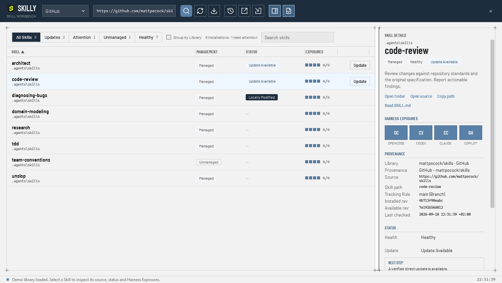

# Skilly

**One home for every agent Skill.**

Skilly is a portable Windows app for managing global agent Skills across OpenCode, Codex, Claude Code, and GitHub Copilot.

> **Status:** Pre-release. [View the v1 spec](https://github.com/berghtho/skilly/issues/19).

The workbench uses a steel-blue header, segmented inventory filters, condensed headings, and square blueprint panels. The Status column highlights health problems, available updates, and failed checks. Update or adopt a Skill directly from its row; inspect Provenance and the four Harness Exposures in the details pane. Review updates, History, Skill Library changes, and SKILL.md share the same styling. Skilly ships its typefaces (Barlow and Barlow Condensed, OFL) inside the executable.

Click a selected row again to clear its details. Ctrl/Shift selection still supports batch Adoption; a row action selects only that Skill. Click Status to sort deviations first, or right-click it to sort by Health or Update separately.

## v1

- Install, inspect, update, adopt, and remove Skills.
- Keep one canonical installation exposed to all four Harnesses.
- Track Provenance, health, and updates without unsafe overwrites.
- Use `skills@1.5.23`, Microsoft APM, or authenticated GitHub via `gh`.
- Stay local: no account, cloud backend, daemon, or credential storage.

Windows 11 x64 only. Portable, self-contained `Skilly.exe`.

## Share Skill sets

Use **Export set** to name a set and select complete Skill folders. The dialog starts with your selected rows, or all Skills if no rows are selected. **Select all** includes Skills hidden by the current inventory filter. Save the `.skilly.zip` file and send it to another Skilly user. Scripts, references, assets, and other files inside each selected folder are included; check those folders for private files before sharing.

Use **Import set** to review the archive and choose Skills to install. Existing names in any supported discovery root are shown as skipped and never overwritten. New Skills are installed in `~/.agents/skills` with a Claude Code junction, making them available to all four Harnesses. Import works offline and does not run bundled scripts or provider commands.

Imported snapshots are **Unmanaged**. They contain the shared file versions; Skilly does not add source credentials or Management Records. Automatic source updates require a later provider-verified Adoption. Invalid metadata, symbolic links, junctions, unsafe paths, unexpected files, and checksum failures reject the archive before installation. Interrupted imports are reconciled at startup; modified or ambiguous content requires recovery instead of being deleted.

The version 1 archive contains `skill-set.json` and files under `skills/<folder-name>/`. Limits are 1,000 Skills, 10,000 files, 64 MiB per file, and 512 MiB of payload. Empty directories are omitted. Checksums detect corrupt payloads; they do not authenticate the sender.

The source inspector searches paths, names, and descriptions. Select a row to preview it; check its box to install it. **Select visible** selects only search results, while **Select none** clears the entire selection. Selections outside the current search remain counted. Existing local destinations stay visible but cannot be selected for installation.

GitHub and Microsoft APM inspections include a read-only SKILL.md preview. The `skills` provider supplies descriptions only. Installed Skills have shortcuts to open their folder or supported HTTPS source, copy their path, and read SKILL.md without launching an editor. Health details explain the next step for collisions, missing files, metadata errors, and broken Harness Exposures.

Updates show a file comparison before applying, including scripts and every affected Skill in an APM package. Installed and available content are checked again when applying. APM changes that add or remove Skills are shown but cannot yet be applied by the managed updater. **Review updates** controls whether the confirmation opens; content checks always run.

Update progress counts affected Skills. **Stop after current** finishes the active provider operation and leaves remaining updates untouched. **History** keeps up to 1,000 per-Skill results locally within 4 MB; interrupted runs are recorded without automatic retries. The workbench wraps its toolbar on smaller screens, supports resizable columns, and lets you collapse or resize details.

[Implementation issues](https://github.com/berghtho/skilly/issues?q=is%3Aissue+is%3Aopen+label%3Aready-for-agent) · [Domain vocabulary](CONTEXT.md)
