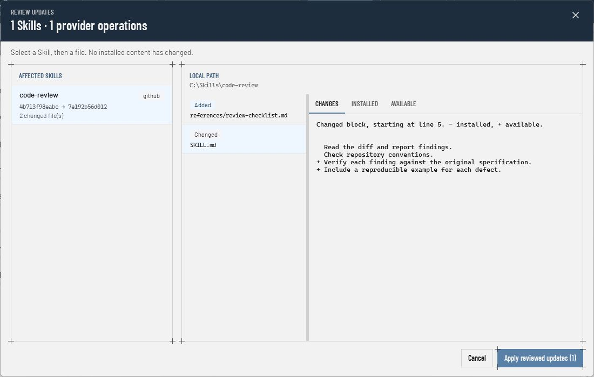
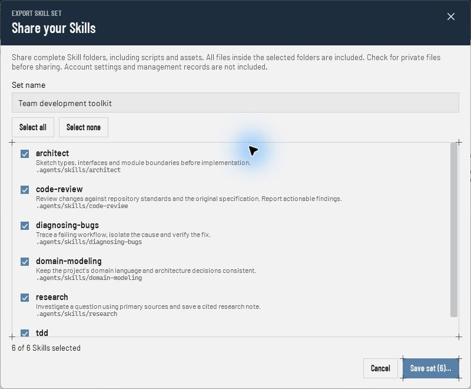
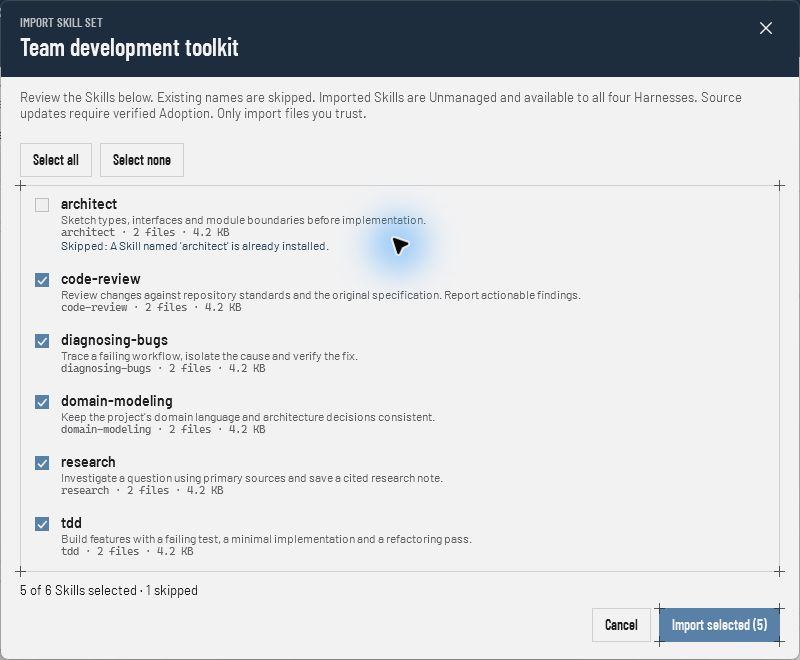

# Skilly

**One home for every agent Skill.**

Find, install, update, and share Skills across **OpenCode, Codex, Claude Code, and GitHub Copilot** from one Windows app. Keep a single copy of each Skill, see where it came from, and review what changes before updating.

A Skill is a folder of instructions and optional scripts, references, or assets that gives your coding agent a reusable workflow. Skilly helps you keep that collection organized as it grows.

**Windows 11 · x64 · Portable · Pre-release**

[Try Skilly](#try-skilly) · [Features](#what-you-can-do) · [Share Skill sets](#share-skill-sets) · [Feedback](https://github.com/berghtho/skilly/issues)


*Screenshots show the current app with an example library. Sources, revisions, and update content are illustrative.*

## Try Skilly

There is no packaged release yet. You can build a portable executable with **Git** and the **.NET 10 SDK** on Windows 11 x64. Run these commands in PowerShell:

```powershell
git clone https://github.com/berghtho/skilly.git
cd skilly
dotnet publish src/Skilly/Skilly.csproj -c Release -r win-x64 --self-contained true -o artifacts/publish
.\artifacts\publish\Skilly.exe
```

The resulting `Skilly.exe` is self-contained: no separate .NET runtime or installer is needed to run it. Skilly has no account, cloud backend, or background daemon.

On first launch, Skilly discovers your existing global Skills. Select one to read its `SKILL.md`, inspect its source and status, or open its folder. Already have a `.skilly.zip` from a teammate? Choose **Import set** to review and add it offline.

## What you can do

| Feature | What it does |
| --- | --- |
| **Browse before installing** | Inspect a source, search by name, path, or description, and choose only the Skills you want. GitHub and Microsoft APM sources include a `SKILL.md` preview. |
| **Manage one collection** | See installed Skills, source information, health, and availability across all four agents in one workbench. Filter, sort, and select multiple rows. |
| **Review updates** | Compare installed and available files, including scripts, before applying an update. Track batch progress and per-Skill results in History. |
| **Bring existing Skills along** | Discover manually installed Skills and adopt them into managed updates when Skilly can verify their source. |
| **Share complete sets** | Bundle selected Skill folders into a ZIP, then import a whole toolkit or just the pieces you need. |

### Install from your sources

Choose a provider, enter a source, and inspect it. Select a row to preview it; check its box to include it in the installation. Existing local destinations remain visible and cannot be overwritten by an install.

Skilly uses the tools already on your machine. You only need the prerequisites for the provider you choose:

| Provider | Prerequisites |
| --- | --- |
| **GitHub** | Git and GitHub CLI (`gh`), authenticated with `gh auth login`. Uses your existing access for private repositories. |
| **skills** | Git, Node.js, npm, and npx. Skilly invokes the pinned `skills@1.5.23` CLI. |
| **Microsoft APM** | The Microsoft `apm-cli` executable (`apm`) on your PATH. |

Skilly checks provider readiness and reports missing or incompatible tools. It does not install those prerequisites or store your source credentials.

## Review changes before updating

See which files were added, changed, or removed, then inspect the diff or either file version. For APM packages, the review includes every affected Skill.



Locally modified content is protected from routine updates. Skilly checks the installed and available content again when applying, so a stale preview cannot silently authorize a different update. During a batch, **Stop after current** finishes the active provider operation and leaves the rest untouched.

## Share Skill sets

Give a teammate your review, testing, and research toolkit in one file.

1. Choose **Export set**, name the set, and select your Skills. Save the `.skilly.zip` file.
2. Share the file. It includes complete Skill folders: instructions, scripts, references, and assets. Check those folders for private files first.
3. In Skilly, choose **Import set**, review the contents, and select what to add. Existing names are skipped; nothing is overwritten.

| Choose what to share | Review what to import |
| --- | --- |
|  |  |

Imports work offline and do not execute bundled scripts or provider commands. New Skills are available to all four agents. They start as **Unmanaged** snapshots of the shared files; source updates require a later, verified Adoption. Sharing a set does not transfer account settings, credentials, or management records.

<details>
<summary>Archive format and validation</summary>

The version 1 archive contains `skill-set.json` and files under `skills/<folder-name>/`. Limits are 1,000 Skills, 10,000 files, 64 MiB per file, and 512 MiB of payload. Empty directories are omitted.

Skilly rejects invalid metadata, symbolic links, junctions, unsafe paths, unexpected files, and checksum failures before installation. Checksums detect corruption; they do not authenticate the sender. Only import files from sources you trust.

Interrupted imports are reconciled at startup. Modified or ambiguous content requires recovery instead of being deleted.

</details>

## How your Skills are organized

New installations live in `~/.agents/skills`, with a Claude Code junction exposing the same files there too. Skilly also discovers supported legacy locations. Source tracking, operation history, and management state stay local.

Skilly currently manages **global Skills on Windows 11 x64**. Project-level Skills are outside its scope. APM updates that add or remove Skills from a package can be previewed, but cannot yet be applied by the managed updater.

## Development and feedback

To run from source during development:

```powershell
dotnet run --project src/Skilly
```

See [release validation](docs/release-validation.md) for build checks and optional live tests, and [CONTEXT.md](CONTEXT.md) for the domain model.

Tried Skilly? [Report a problem or suggest an improvement](https://github.com/berghtho/skilly/issues). Include your provider and the action you were taking so the behavior is easy to reproduce.
